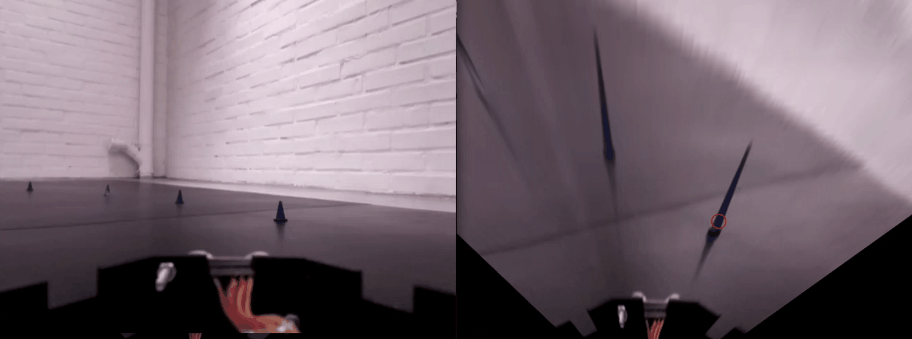

# DIT638 Cyber Physical Systems & Systems of Systems

 

## What?
A microservice performing image recognition for a self driving vehicle.

## Why?
To detect the road ahead and steer the miniature vehicle accordingly.

## How?
The application is developed for the [Kiwi platform](https://github.com/chalmers-revere/opendlv-tutorial-kiwi) and runs as a separate  microservice. It uses [libcluon](https://github.com/chrberger/libcluon) to connect to a shared memory where image data from the car is received. It performs object detection using [OpenCV](https://opencv.org/), discovering centre points of blue and yellow cones ahead and computes matching steering requests for the Kiwi car.

 
*Detecting cones using Color Processing and Noise Reduction*

## Software Design
The application decomposes the task of image recognition using [Pipe and Filters](https://docs.microsoft.com/en-us/azure/architecture/patterns/pipes-and-filters). The filters perform Colour Processing, Noise Reduction, Contour Finding and View Changes as well as calculations for the steering angle of the car.

## Technologies used for development
- [Linux](https://ubuntu.com/blog/tag/ubuntu-18-04)
- [Docker](https://www.docker.com/)
- [CMake](https://cmake.org/)
- [OpenCV](https://opencv.org/)
- C++

## Testing and Continuous Integration
- Unit tests have been written using the C++ testing library [Catch2](https://github.com/catchorg/Catch2).

- Using [GitLab CI/CD](https://docs.gitlab.com/ee/ci/), a test coverage report is generated automatically on a successful build. The test coverage reports are created by adding the GCOV flag to the compilation, running the unit tests and then running a bash script with LCOV on the .gcda files from the compilation. The html files which was the outcome from running LCOV is then merged within GitLab pipeline into a pdf that can be displayed as an artifact on the Gitlab repository.  

- Automatic code evaluation and security checks has been performed with [Flawfinder](https://dwheeler.com/flawfinder/), [Scan Build](https://clang-analyzer.llvm.org/scan-build.html) and [PMCCABE](https://people.debian.org/~bame/pmccabe/overview.html)

- Acceptance Testing has been generated using Python3 and [Matlibplot libary](https://matplotlib.org/).

## Developers
- [Emanuel Dellsén](https://github.com/EmanuelDellsen)
- [Susan Lieu](https://github.com/SusanLieu)
- [Niklas Möller](https://github.com/NiklasMoller)
- [Karl Westgårdh](https://github.com/KarlWestgardh)

## Build the application
The project is best managed on a Linux machine with Ubuntu 18.04.
It uses g++, CMake, Git and Docker

For installation, run these commands in your terminal to make sure your system is up to date:

> sudo apt-get update
>
> sudo apt-get upgrade

Install development tools (g++, CMake, Git):

> sudo apt-get update
>
> sudo apt-get install build-essential cmake git

Install Docker Engine by following the [official guidelines](https://docs.docker.com/install/linux/docker-ce/ubuntu/).

Give your user superpriviliges to run Docker:

> sudo usermod -aG docker $USER

## Running the application
The application can be started using a bash script from the root folder:

> bash project-starter

This will pull [opendlv-video-h264-decoder](https://github.com/chalmers-revere/opendlv-video-h264-decoder) and [opendlv-vehicle-view](https://github.com/chalmers-revere/opendlv-vehicle-view) which enables playing of [recording files](https://github.com/chalmers-revere).
